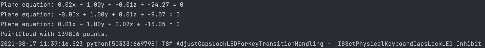
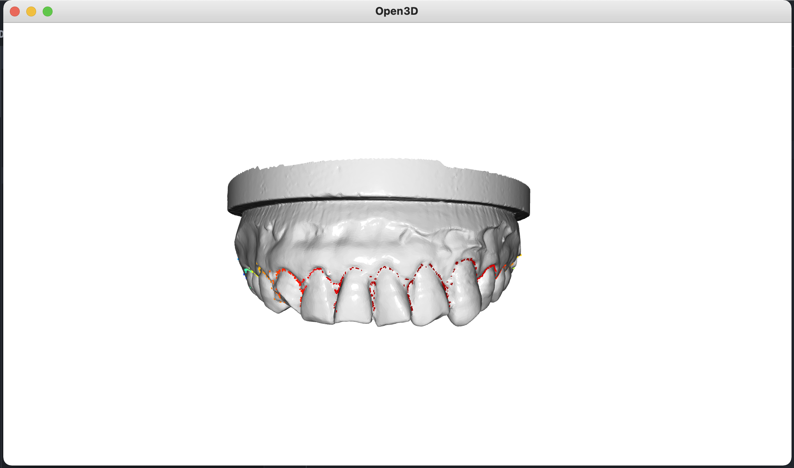
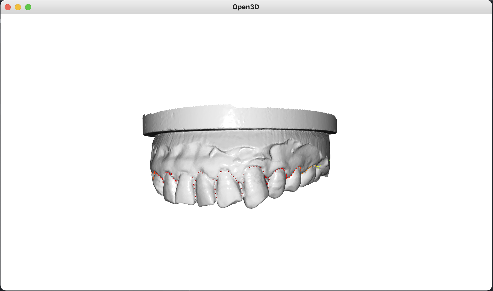
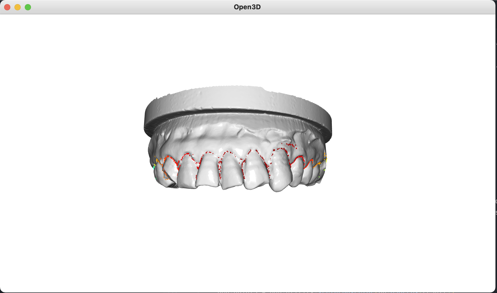
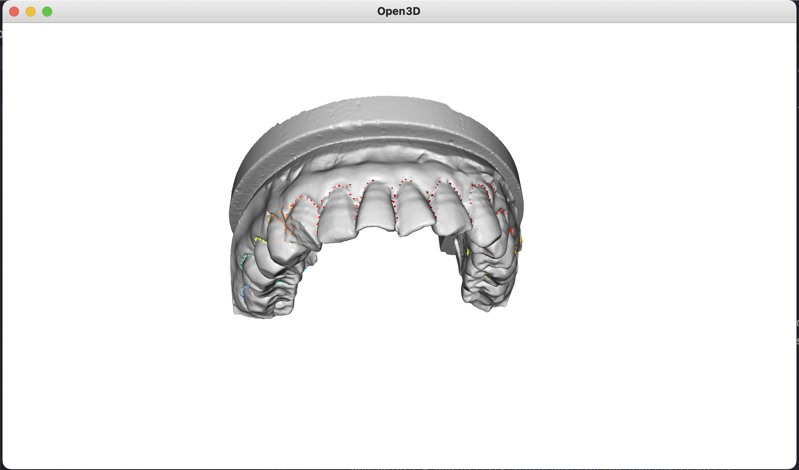

# 3D 颈缘线识别

## 	文件树

.

├── Example.stl			 —— 三角网格输入文件

├── README.md		   —— README

├── main.py				   —— 主函数文件

└── requirements.txt	 —— pip依赖项

### 安装

`pip install -r requirements.txt`

或者

`conda env create -f environment.yml`

### 运行

`python main.py`

### 结果

控制台

窗口一

窗口二

## 设计思路

1. 边检测算法；

   

2. 多次RANSAC算法去掉多余点；

3. 根据平均曲率匹配特征点；

   

4. 体素降采样和离群点去噪声。

   